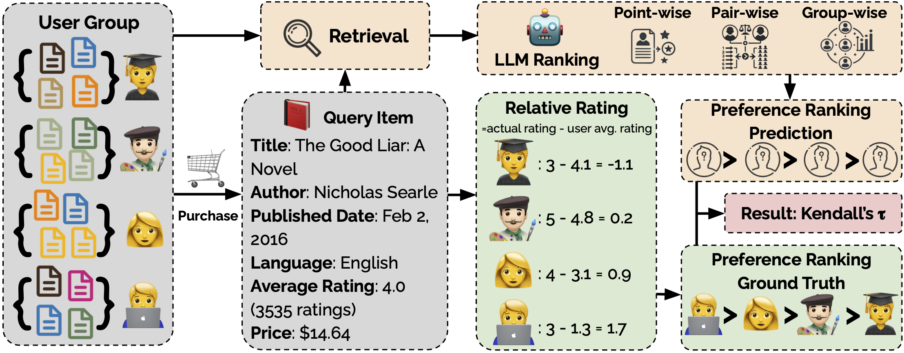

# Can Large Language Models Understand Preferences in Personalized Recommendation?

This is the official implementation of paper

[**Can Large Language Models Understand Preferences in Personalized Recommendation?**](https://arxiv.org/abs/2501.13391).

[Zhaoxuan Tan](https://zhaoxuan.info/), 
Zinan Zeng, 
[Qingkai Zeng](https://qingkaizeng.github.io/), 
[Zhenyu Wu](https://scholar.google.com/citations?user=5tVLNpYAAAAJ&hl=zh-CN), 
[Zheyuan Liu](https://franciscoliu.github.io/), 
[Fengran Mo](https://fengranmark.github.io/), 
[Meng Jiang](http://www.meng-jiang.com/)

[paper]: https://arxiv.org/abs/2501.13391
*work in progress*

Large Language Models (LLMs) excel in various tasks, including personalized recommendations. Existing evaluation methods often focus on rating prediction, relying on regression errors between actual and predicted ratings. However, **user rating bias** and **item quality**, two influential factors behind rating scores, can obscure personal preferences in user-item pair data. To address this, we introduce **PerRecBench**, disassociating the evaluation from these two factors and assessing recommendation techniques on capturing the personal preferences in a grouped ranking manner. We find that the LLM-based recommendation techniques that are generally good at rating prediction fail to identify users' favored and disfavored items when the user rating bias and item quality are eliminated by grouping users. With **PerRecBench** and 19 LLMs, we find that while larger models generally outperform smaller ones, they still struggle with personalized recommendation. Our findings reveal the superiority of pairwise and listwise ranking approaches over pointwise ranking, **PerRecBench**'s low correlation with traditional regression metrics, the importance of user profiles, and the role of pretraining data distributions. We further explore three supervised fine-tuning strategies, finding that merging weights from single-format training is promising but improving LLMs' understanding of user preferences remains an open research problem.


<div  align="center">    

</div>

## Results on PerRecBench ##

Scores range from -1 to 1, with higher values indicating better performance.

| **Model**                     |  easy     |  easy    |  easy    |    medium |  medium  |  meidum  | hard      | hard      | hard  | **Avg.** |
|-------------------------------|-----------|-----------|---------|-----------|-----------|----------|-----------|----------|-----------|----------|
|                               | pointwise | pairwise | listwise | pointwise | pairwise | listwise | pointwise | pairwise | listwise |    |
| Llama3.1-8B-it       | -0.27     | 0.25     | 0.30     | 0.03      | -0.01    | -0.01    | -0.03     | 0.07     | 0.05     | 0.04     |
| Gemma-2-9B-it        | 0.13      | 0.23     | 0.25     | 0.00      | 0.10     | -0.08    | 0.03      | 0.05     | 0.09     | 0.09     |
| Qwen2.5-7B-it        | -0.10     | 0.17     | 0.16     | 0.06      | 0.05     | -0.05    | 0.02      | 0.08     | 0.02     | 0.05     |
| Ministral-8B-it      | -0.04     | 0.02     | 0.09     | 0.00      | 0.06     | -0.01    | 0.05      | 0.02     | 0.01     | 0.02     |
| Mistral-12B-Nemo-it  | -0.11     | 0.14     | 0.37     | 0.00      | 0.07     | 0.01     | 0.05      | 0.02     | -0.10    | 0.05     |
| Qwen2.5-14B-it       | 0.09      | 0.23     | 0.17     | 0.05      | 0.10     | 0.03     | 0.08      | 0.09     | 0.02     | 0.10     |
| Gemma-2-27B-it       | 0.21      | 0.15     | 0.15     | 0.02      | 0.03     | -0.01    | 0.06      | 0.07     | 0.02     | 0.08     |
| Mixtral-8x22B-it     | -0.02     | 0.25     | 0.35     | 0.05      | 0.11     | 0.03     | 0.05      | 0.09     | 0.07     | 0.11     |
| Qwen2.5-32B-it       | 0.21      | 0.26     | 0.35     | -0.01     | 0.09     | 0.02     | 0.08      | 0.07     | 0.07     | 0.13     |
| Qwen2.5-Coder-32B-it | 0.04      | 0.26     | 0.12     | 0.01      | 0.06     | 0.02     | 0.03      | 0.06     | 0.03     | 0.07     |
| Qwen2.5-72B-it       | 0.09      | 0.27     | 0.24     | 0.04      | 0.10     | 0.06     | 0.04      | 0.09     | 0.03     | 0.11     |
| Llama-3.1-70B-it     | 0.09      | 0.31     | 0.32     | 0.00      | 0.09     | 0.13     | 0.09      | 0.12     | 0.10     | 0.14     |
| Mistral-Large-123B-it| 0.19      | 0.31     | 0.33     | 0.09      | 0.09     | 0.06     | 0.09      | 0.08     | 0.07     | 0.15     |
| Llama-3.1-405B-it    | 0.14      | 0.31     | 0.38     | 0.08      | 0.09     | 0.05     | 0.05      | 0.08     | 0.11     | 0.14     |
| DeepSeek-v3-671B     | 0.23      | 0.21     | 0.23     | 0.13      | 0.10     | 0.06     | 0.14      | 0.06     | 0.06     | 0.14     |
| Claude-3.5-Haiku     | 0.21      | 0.27     | 0.32     | 0.09      | 0.08     | 0.10     | 0.09      | 0.04     | 0.02     | 0.14     |
| Claude-3.5-Sonnet    | 0.27      | 0.34     | 0.31     | 0.11      | 0.07     | 0.14     | 0.13      | 0.10     | 0.12     | 0.18     |
| GPT-4o-mini          | 0.20      | 0.31     | 0.41     | 0.13      | 0.04     | 0.05     | 0.07      | 0.05     | 0.04     | 0.15     |
| GPT-4o               | 0.25      | 0.29     | 0.27     | 0.10      | 0.07     | 0.11     | 0.08      | 0.07     | 0.06     | 0.15     |

## Installation ##
We provide an [environment file](environment.yml) including the python package versions we used in our experiments. For optimal reproducibility, we recommend using the same package versions. However, please note that results may still vary due to differences in hardware configurations and CUDA versions, etc.

First, install a python virtual environment using conda:
```bash
conda create -n perrecbench python=3.10 && conda activate perrecbench
```

Next, install the remaining packages.
```bash
conda install pytorch==2.4.0 torchvision==0.19.0 torchaudio==2.4.0 pytorch-cuda=12.1 -c pytorch -c nvidia
pip install transformers==4.46.2
python -m pip install flash-attn --no-build-isolation
pip install openai
pip install together
pip install google-generativeai
pip install mistralai
pip install anthropic
pip install rank_bm25
pip install vllm==0.6.3.post1
```

## Download Data

Please download the data using this [link](https://drive.google.com/file/d/1Px0VosZH0YHmg6y9BbMMFEwraDKAzs4o/view?usp=sharing), place it in the ```./data``` folder, and unzip.

Alternatively, you can use gdown
```bash
pip install gdown
cd data
gdown "https://drive.google.com/uc?id=1Px0VosZH0YHmg6y9BbMMFEwraDKAzs4o"
unzip data-public.zip
cd ../
```

## Launch vLLM (if host model locally) ##
If you want to evaluate the local model, **replace the model name and served model name in ```code/start_vllm.sh``` file** and use the following command to launch the vllm server.
```bash
cd code
bash start_vllm.sh
```

If you want to host a model with LoRA, please check out the ```code/start_vllm-lora.sh``` file.

## Run the Inference ##
First, choose the corresponding model in ```code/run_abs_rating.sh`` file, including the API engine, API KEY, and MODEL_ID. Now run the LLM inference.

```bash
bash run_abs_rating.sh
```

## Evaluation ##
Change the MODEL_ID in ```code/evaluate_model_abs.sh`` and run the following command:

```bash
bash evaluate_model_abs.sh
```

## Model SFT ##
For improvement, please try supervised finetuning (SFT).
```bash
cd ../sft
bash run-lora.sh
```
You can modify the ```dataset_mixer``` parameter in ```sft/config_lora.yaml``` file to change the SFT data format. Get the corresponding model trained with point, pair, group, and mixed data format. For model merging, please check out the ```sft/merge_model_weight.py``` file, and run the code after changing the code to your local path. 

## Citation ##
If you find this codebase useful in your research, please cite the following paper.

```bibtex
@article{tan2025can,
  title={Can Large Language Models Understand Preferences in Personalized Recommendation?},
  author={Tan, Zhaoxuan and Zeng, Zinan and Zeng, Qingkai and Wu, Zhenyu and Liu, Zheyuan and Mo, Fengran and Jiang, Meng},
  journal={arXiv preprint arXiv:2501.13391},
  year={2025}
}
```